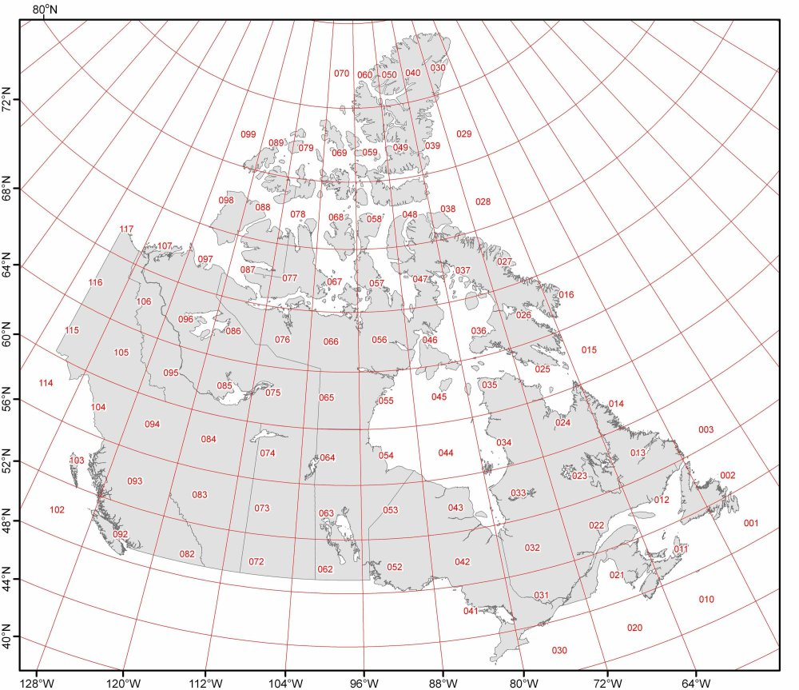
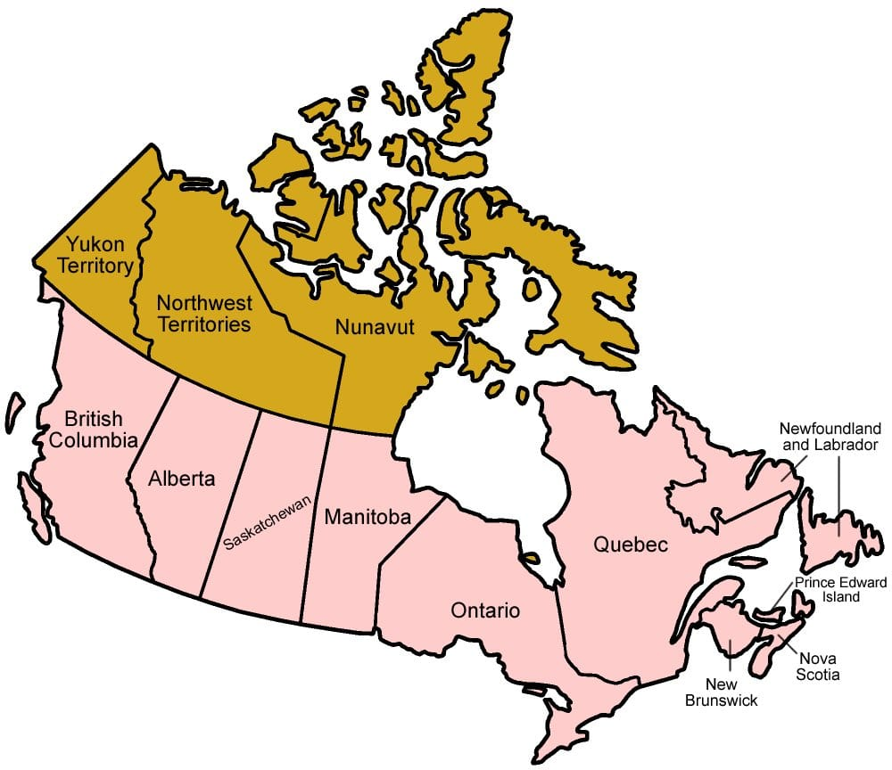

  
```{r setup, include=FALSE}
knitr::opts_chunk$set(echo = TRUE)
```

El manejo de las diferentes herramientas y técnicas de visualización es indispensable para la creación de una buena visualización de datos. En esta actividad el estudiante debe demostrar el conocimiento de los diversos tipos gráficos creando tres visualizaciones diferentes con técnicas que le serán asignadas. Para cada técnica propuesta, el estudiante tendrá que escoger unos datos adecuados y decidir con qué herramienta o lenguaje de programación las crea.

Entre las técnicas existentes, se han asignado las siguientes para la entrega:
  <ol start="1">
  <li>Histograms</li>
  <li>Voronoy diagram</li>
  <li>Ridgeline Chart</li>
  </ol>
  

En lo referente a los datos, se ha escogido el conjunto de datos [Capstone Wildfires in Canada](https://www.kaggle.com/code/accastano/capstone-wildfires-in-canada/input) de Kaggle.


Antes de comenzar la entrega, debemos comprobar si están instalados todos los paquetes que se usarán en los apartados sucesivos. Para ello, primero probaremos a importar cada una de las librerías. En caso de que alguna de ellas no esté instalada, saltará un error y la instalaremos.

```{r message=FALSE, warning=FALSE}
# Lista de librerías a importar
librerias <- c("ggplot2", "IRdisplay", "dplyr", "ggridges", "viridis", "hrbrthemes", "deldir")

# Intentamos importar cada paquete
for (libreria in librerias) {
  if (!require(libreria, character.only = TRUE)) {
    install.packages(libreria)
    require(libreria, character.only = TRUE)
  }
}

```

# Preprocesado

Para iniciar esta segunda práctica, cargaremos el fichero de incendios de Canadá y estudiaremos sus variables para quedarnos con aquellas necesarias. 

```{r message=FALSE, warning=FALSE}
# Cargamos el conjunto de datos
canada_wildfires <- read.csv("CANADA_WILDFIRES.csv", sep = ",", fileEncoding = "latin1")

# Reducción del conjunto de datos original a las variables que utilizaremos
variables_a_tratar <- c("FID", "SRC_AGENCY", "LATITUDE", "LONGITUDE", "REP_DATE", "SIZE_HA", "ECOZ_NAME")
canada_wildfires <- subset(canada_wildfires, select = variables_a_tratar)

# Redondeamos la latitud y longitud para mayor comprensión
canada_wildfires$LATITUDE <- round(canada_wildfires$LATITUDE, 0)
canada_wildfires$LONGITUDE <- round(canada_wildfires$LONGITUDE, 0)

# Definimos un vector con los nuevos nombres de las columnas
nuevos_nombres <- c("Fire_ID", "Provincia", "Latitud", "Longitud", "Fecha", "Hectareas", "Zona")

# Asignar los nuevos nombres a las columnas del conjunto de datos
colnames(canada_wildfires) <- nuevos_nombres

# Veamos las 5 primeras líneas del conjunto de datos
head(canada_wildfires)
```


Para mayor comprensión de las siguientes técnicas de visualización aplicadas, aquí dejamos dos mapas de Canadá: uno con sus coordenadas de Latitud y Longitud y otro con las provincias del país:


<center>



</center>

<center>



</center>

# Técnicas de Visualización

En este apartado hablaremos de las 3 técnicas de visualización asignadas para esta entrega. Cada una de ellas contendrá una serie de apartados, que serán los siguientes:

  <ol start="1">
  <li>Definición y Origen de la visualización</li>
  <li>Descripción de su funcionamiento</li>
  <li>Tipos de datos que representan</li>
  <li>Limitaciones</li>
  <li>Ejemplos de aplicación y Ejemplo práctico</li>
  </ol>


## Histogramas

### Definición y Origen de la visualización
Un **histograma** es un gráfico, introducido por el estadístico inglés Karl Pearson, que representa la distribución de un conjunto de datos numéricos en intervalos o *bins*. 


### Descripción de su funcionamiento
El objetivo es mostrar la frecuencia de unos valores en una serie de columnas segmentadas, por ende primero dividiremos la muestra en intervalos. Luego, contaremos cuántos valores recaen en cada intervalo. Así se crea cada *bin* del gráfico, con una altura proporcional al recuento y una anchura igual al tamaño del intervalo.

### Tipos de datos que representan
Esta técnica sirve para representar una muestra basada en una variable numérica o cuantitativa.

### Limitaciones
Algunas de las limitaciones más comunes son:
  <ol start="1">
  <li>Solo sirve para valores cuantitativos.</li>
  <li>Es sensible a los *outliers* y a los cambios del número de *bins*.</li>
  <li>No son adecuados para comparaciones entre variables.</li>
  </ol>
  

### Ejemplos de aplicación y Ejemplo práctico
Algunos ejemplos de aplicación pueden ser estudiar la distribución por intervalos de edad en un encuesta o la frecuencia de llamadas que recibe un *call-center* por día.

Para esta técnica se ha decidido hacer un histograma para ver la distribución de las longitudes más afectadas de Canadá en el 2000. Para ello, se ha cogido como muestra los datos del 2000 y se ha definido que queremos 10 intervalos. Por ende, para rellenar el histograma se ha contado cuantas veces se han incendiado dichos intervalos o *bins*.

```{r message=FALSE, warning=FALSE}
# Filtraremos el conjunto de datos tal que queremos los incendios del 2000
canada_wildfires_2000 <- canada_wildfires[grep("^2000", canada_wildfires$Fecha), ]

# Crearemos un histograma para ver la frecuencia de longitudes afectadas en el 2000
ggplot(canada_wildfires_2000, aes(x = Longitud)) +
  geom_histogram(aes(fill = ..count..), binwidth = 10, color = "white") +
  scale_fill_gradient(low = "red", high = "yellow") +
  labs(title = "Histograma de Longitudes Afectadas en el 2000", x = "Longitud", y = "Frecuencia") +
  theme_minimal() + 
  theme(plot.title = element_text(hjust = 0.5)) 

```

## Diagrama de Voronoy

### Definición y Origen de la visualización
Los **Diagramas de Voronoy** o **Polígonos de Thiessen** son una técnica que consiste en la división de un plano de *n* puntos de control en polígonos convexos basándose en la proximidad de dichos puntos.

Como sus nombres indican, esta técnica debe su nombre a los matemáticos Georgy Voronoy y Alfred Thiessen que los investigaron.

### Descripción de su funcionamiento
Esta técnica es compleja. Primero, debemos partir de una muestra de *n* puntos generadores. Luego, se calculará la distancia entre todos estos puntos y, para aquellos puntos que sean adyacentes, se calcularán las fronteras. Estas fronteras son líneas equidistantes entre 2 puntos adyacentes, por lo que al cortarse unas con las otras, generarán las aristas de los polígonos y, al final, el diagrama en sí.


### Tipos de datos que representan
Los puntos generadores o de control deben ser un tupla (X,Y) de valores cuantitativos, por ende debemos partir o de una columna de datos con dicha tupla o dos variables numéricas que nos den las coordenadas de los puntos.

### Limitaciones
Algunas de las limitaciones más comunes de esta técnica son:

  <ol start="1">
  <li>Es muy sensible a la muestra de puntos generadores:
    <ul>
      <li>Si el conjunto es muy pequeño, puede no ser representativo de la distribución.</li>
      <li>Si es muy grande, tendremos un gran coste computacional y fronteras abruptas que dificulten su estudio.</li>
    </ul>
  </li>
  <li>Si los puntos se acercan a los bordes del plano puede afectar a la forma del diagrama.</li>
  <li>Sensibilidad a la distancia escogida para dibujar los polígonos según estén dispuestos los puntos.</li>
  </ol>

### Ejemplos de aplicación y Ejemplo práctico
Esta técnica se usa en contextos espaciales, por ende algunos ejemplos de uso son la situación actual de precipitaciones en las estaciones meteorológicas o los mapas cartográficos con coordenadas.

Partiendo de este último ejemplo, he generado el ejemplo práctico. A partir de las coordenadas de longitud y latitud del Yukon, la provincia más al noroeste de Canadá, estudiaremos la localización y proximidad de sus incendios en el 2000:


```{r message=FALSE, warning=FALSE}
# Ahora nos centraremos en los incendios del 2000 en el Territorio del Yukon
canada_wildfires_YT <- subset(canada_wildfires_2000, Provincia == "YT")

# Calculamos el diagrama de Voronoi
voronoi <- deldir(canada_wildfires_YT$Longitud, canada_wildfires_YT$Latitud)
tiles <- tile.list(voronoi)

# Mostramos el diagrama
plot(tiles,
     pch = 8,
     cex=1.5,
     border = "white",
     col.pts = "white",
     xlab = "Longitud",
     ylab = "Latitud",
     fillcol = hcl.colors(50, "YlOrRd"))
```


## Ridgeline Chart

### Definición y Origen de la visualización
Un gráfico **Ridgeline**, también llamado **Joyplot** por el álbum *Unknown Pleasures* de Joy Division, consiste en un técnica para mostrar la distribución de un valor cuantitativo para varios grupos alineados horizontalmente. Su origen se remonta a una publicación de la CIA que luego Zoni Nation pulió para crear esta técnica en R.

### Descripción de su funcionamiento
Primero, antes de realizar esta técnica debemos buscar una muestra cuantitativa con suficientes datos y una categorización para esta. Luego, dividiremos la muestra en intervalos y grupos. Por último, contaremos cuántos valores recaen en cada intervalo de cada grupo.

### Tipos de datos que representan
Esta técnica usa varias variables: una de tipo cuantitativo o numérico para ver su distribución y una de tipo categórica para los grupos a estudiar.

### Limitaciones
Algunas de las limitaciones más comunes de esta técnica son:
  <ol start="1">
  <li>Dado que usa histogramas o gráficos de densidad para cada grupo, presenta sus limitaciones también:
    <ul>
      <li>Sensibilidad al número de *bins* escogidos o el ancho de banda.</li>
      <li>Solo para valores cuantitativos en la distribución.</li>
      <li>Demás limitaciones de la técnica de cada grupo.</li>
    </ul>
  </li>
  <li>Un alto número de grupos o categorías lo hará confuso y difícil de estudiar (menos a 6 es lo adecuado).</li>
  </ol>

### Ejemplos de aplicación y Ejemplo práctico
Algunos ejemplos de uso de esta técnica pueden ser la distribución de las repuestas de una encuesta por su tipo (Totalmente de acuerdo, parcialmente de acuerdo, neutro, etc.) o la frecuencia de las temperaturas por mes del año.

Basándonos en el último ejemplo, he implementado esta técnica, es decir, estudiaremos la distribución de hectáreas quemadas por mes del año. Dado que el conjunto de datos es extenso, focalizaremos la muestra a los 50 incendios más grandes de Canadá.

```{r message=FALSE, warning=FALSE}
# Extraemos el número de mes de cada incendio y lo transformamos a texto
canada_wildfires <- canada_wildfires %>%  mutate(Mes = as.numeric(substr(Fecha, 6, 7)))
canada_wildfires$Mes <- month.name[canada_wildfires$Mes]
canada_wildfires$Mes <- factor(canada_wildfires$Mes, levels = month.name)

# Extraemos los 50 mayores incendios de Canadá
top_50_incendios <- head(arrange(canada_wildfires, desc(Hectareas)), 50)

# Mostramos el diagrama Ridgeline
ggplot(top_50_incendios, aes(x = Hectareas, y = as.factor(Mes), fill = as.factor(Mes))) +
  geom_density_ridges_gradient(scale = 3,
                               rel_min_height = 0.01,
                               color = "white") +
  scale_fill_brewer(palette = "YlOrRd") + 
  labs(title = "Distribución de las Hectáreas quemadas en Top 50 Indendios de Canadá",
       x = "Hectáreas",
       y = "Mes") +
  theme_minimal() +
  theme(
    legend.position = "none",  
    panel.spacing = unit(0.1, "lines"),
    strip.text.x = element_text(size = 8),
    plot.title = element_text(hjust = 0.5)
  )

```


